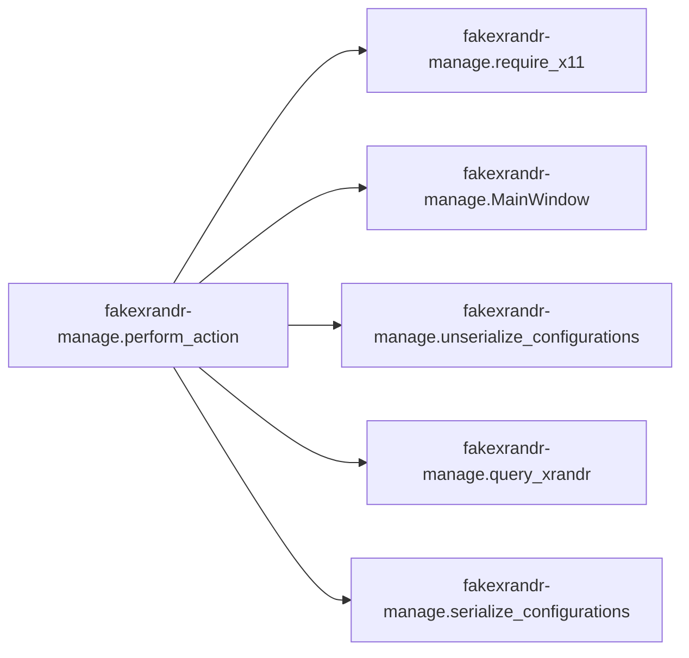

# Key Objects

[_Documentation generated by Documatic_](https://www.documatic.com)

<!---Documatic-section-fakexrandr_manage.serialize_configurations-start--->
## fakexrandr-manage.serialize_configurations

<!---Documatic-section-serialize_configurations-start--->
<!---Documatic-block-fakexrandr_manage.serialize_configurations-start--->
<details>
	<summary><code>fakexrandr_manage.serialize_configurations</code> code snippet</summary>

```python
def serialize_configurations(configurations):
    retval = []
    for config in configurations:
        sconfig = bytes(config)
        retval.append(struct.pack('=I', len(sconfig)))
        retval.append(sconfig)
    return b''.join(retval)
```
</details>
<!---Documatic-block-fakexrandr_manage.serialize_configurations-end--->
<!---Documatic-section-serialize_configurations-end--->

# #
<!---Documatic-section-fakexrandr_manage.serialize_configurations-end--->

<!---Documatic-section-fakexrandr_manage.query_xrandr-start--->
## fakexrandr-manage.query_xrandr

<!---Documatic-section-query_xrandr-start--->
<!---Documatic-block-fakexrandr_manage.query_xrandr-start--->
<details>
	<summary><code>fakexrandr_manage.query_xrandr</code> code snippet</summary>

```python
def query_xrandr():
    root_window = libX11.XDefaultRootWindow(display)
    screen_resources = libXrandr.XRRGetScreenResources(display, root_window)
    to_dict = lambda what: dict(((x, getattr(out.contents, x)) for x in dir(what.contents) if x[0] != '_'))
    edidAtom = libX11.XInternAtom(display, b'EDID', 1)
    crtcs = {}
    for i in range(screen_resources.contents.ncrtc):
        out = libXrandr.XRRGetCrtcInfo(display, screen_resources, screen_resources.contents.crtcs[i])
        crtcs[screen_resources.contents.crtcs[i]] = to_dict(out)
        libXrandr.XRRFreeCrtcInfo(out)
    outputs = {}
    for i in range(screen_resources.contents.noutput):
        out = libXrandr.XRRGetOutputInfo(display, screen_resources, screen_resources.contents.outputs[i])
        if out.contents.crtc == 0:
            continue
        actual_type = ctypes.c_long()
        actual_format = ctypes.c_int()
        nitems = ctypes.c_ulong()
        bytes_after = ctypes.c_ulong()
        prop = ctypes.c_void_p()
        libXrandr.XRRGetOutputProperty(display, screen_resources.contents.outputs[i], edidAtom, 0, 384, False, False, 0, ctypes.byref(actual_type), ctypes.byref(actual_format), ctypes.byref(nitems), ctypes.byref(bytes_after), ctypes.byref(prop))
        if nitems.value > 0:
            outputs[out.contents.name] = to_dict(out)
            outputs[out.contents.name]['edid'] = ''.join(('%02x' % ctypes.cast(prop.value + i, ctypes.POINTER(ctypes.c_ubyte)).contents.value for i in range(nitems.value))).encode('ascii')
            outputs[out.contents.name]['crtc'] = crtcs[outputs[out.contents.name]['crtc']]
        libXrandr.XRRFreeOutputInfo(out)
    libXrandr.XRRFreeScreenResources(screen_resources)
    return outputs
```
</details>
<!---Documatic-block-fakexrandr_manage.query_xrandr-end--->
<!---Documatic-section-query_xrandr-end--->

# #
<!---Documatic-section-fakexrandr_manage.query_xrandr-end--->

<!---Documatic-section-fakexrandr_manage.rounded_rectangle-start--->
## fakexrandr-manage.rounded_rectangle

<!---Documatic-section-rounded_rectangle-start--->
<!---Documatic-block-fakexrandr_manage.rounded_rectangle-start--->
<details>
	<summary><code>fakexrandr_manage.rounded_rectangle</code> code snippet</summary>

```python
def rounded_rectangle(cr, x, y, w, h, r=20):
    cr.move_to(x + r, y)
    cr.line_to(x + w - r, y)
    cr.curve_to(x + w, y, x + w, y, x + w, y + r)
    cr.line_to(x + w, y + h - r)
    cr.curve_to(x + w, y + h, x + w, y + h, x + w - r, y + h)
    cr.line_to(x + r, y + h)
    cr.curve_to(x, y + h, x, y + h, x, y + h - r)
    cr.line_to(x, y + r)
    cr.curve_to(x, y, x, y, x + r, y)
```
</details>
<!---Documatic-block-fakexrandr_manage.rounded_rectangle-end--->
<!---Documatic-section-rounded_rectangle-end--->

# #
<!---Documatic-section-fakexrandr_manage.rounded_rectangle-end--->

<!---Documatic-section-fakexrandr_manage.unserialize_configurations-start--->
## fakexrandr-manage.unserialize_configurations

<!---Documatic-section-unserialize_configurations-start--->
<!---Documatic-block-fakexrandr_manage.unserialize_configurations-start--->
<details>
	<summary><code>fakexrandr_manage.unserialize_configurations</code> code snippet</summary>

```python
def unserialize_configurations(data):
    while data:
        (length,) = struct.unpack('=I', data[:4])
        yield Configuration.new_from_str(data[4:4 + length])
        data = data[4 + length:]
```
</details>
<!---Documatic-block-fakexrandr_manage.unserialize_configurations-end--->
<!---Documatic-section-unserialize_configurations-end--->

# #
<!---Documatic-section-fakexrandr_manage.unserialize_configurations-end--->

<!---Documatic-section-fakexrandr_manage.perform_action-start--->
## fakexrandr-manage.perform_action

<!---Documatic-section-perform_action-start--->


### Object Calls

* fakexrandr-manage.require_x11
* fakexrandr-manage.MainWindow
* fakexrandr-manage.unserialize_configurations
* fakexrandr-manage.query_xrandr
* fakexrandr-manage.serialize_configurations

<!---Documatic-block-fakexrandr_manage.perform_action-start--->
<details>
	<summary><code>fakexrandr_manage.perform_action</code> code snippet</summary>

```python
def perform_action(action):
    if action == 'gui':
        if not HAS_GTK:
            print('The GUI requires PyGObject.', file=sys.stderr)
            sys.exit(1)
        require_x11()
        wnd = MainWindow()
        wnd.show_all()
        Gtk.main()
    elif action == 'dump-config':
        if os.access(CONFIGURATION_FILE_PATH, os.R_OK):
            try:
                for config in unserialize_configurations(open(CONFIGURATION_FILE_PATH, 'rb').read()):
                    print('NAME="%s"\nEDID=%s\nWIDTH=%d\nHEIGHT=%d' % (config.name.decode(), config.edid.decode(), config.width, config.height))
                    print('SPLITS="%s"' % config.human_readable_splits_str)
                    print()
            except:
                print('Failed to load configurations from %s' % CONFIGURATION_FILE_PATH, file=sys.stderr)
                sys.exit(1)
        else:
            print('There does not exist a configuration in %s yet.' % CONFIGURATION_FILE_PATH, file=sys.stderr)
            sys.exit(1)
    elif action == 'show-available':
        require_x11()
        for (name, output) in query_xrandr().items():
            print('NAME="%s"\nEDID=%s\nWIDTH=%d\nHEIGHT=%d\nSPLITS="N"\n' % (name.decode(), output['edid'].decode(), output['crtc']['width'], output['crtc']['height']))
    elif action == 'clear-config':
        if os.access(CONFIGURATION_FILE_PATH, os.R_OK):
            os.unlink(CONFIGURATION_FILE_PATH)
    elif action == 'set-config':
        if os.access(CONFIGURATION_FILE_PATH, os.R_OK):
            configurations = {'%s-%d-%d' % (x.edid, x.width, x.height): x for x in unserialize_configurations(open(CONFIGURATION_FILE_PATH, 'rb').read())}
        else:
            configurations = {}
        for configuration in sys.stdin.read().split('\n\n'):
            variables = dict((x.split('=', 1) for x in shlex.split(configuration)))
            if not variables:
                continue
            config = Configuration.new_from_shdict(variables)
            config_key = '%s-%d-%d' % (config.edid, config.width, config.height)
            if variables['SPLITS'] == 'N':
                if config_key in configurations:
                    del configurations[config_key]
            else:
                configurations[config_key] = config
        configuration_data = serialize_configurations(configurations.values())
        with open(CONFIGURATION_FILE_PATH, 'wb') as output:
            output.write(configuration_data)
    elif action == 'short-help':
        print("fakexrandr manage script\nSyntax: fakexrandr-manage <gui|dump-config|show-available|clear-config|\n                           set-config|help>\n\nI'd run the gui per default for you, but PyGobject isn't installed.\n\n")
    else:
        print('fakexrandr manage script\nSyntax: fakexrandr-manage <gui|dump-config|show-available|clear-config|\n                           set-config>\n\nAvailable commands:\n  gui\n    Run the GTK based gui\n  dump-config\n   Dump the configuration file in a parseable format to the console. Different\n   configurations are separated by an empty line.\n  show-available\n   Query XRandR and show outputs for which a configuration could be created.\n  clear-config\n   Remove all stored configurations\n  set-config\n   Load configurations from the standard input and merge them into the\n   configuration file\n\nConfiguration format:\n  The CLI configuration format follows sh syntax and defines the variables NAME,\n  EDID, WIDTH, HEIGHT and SPLITS. SPLITS is a string describing how an output\n  shall be split. It starts by one of the letters H, V or N, describing the\n  kind of split. H means horizontal, V vertical and N no split. Separated by a\n  space follows the pixel position of the split. Again separated by a space\n  follow the two sub-configurations of the left/right or top/bottom halves. Any\n  additional white-space besides a single space is optional any only serves\n  better readibility. dump-config indents sub-configurations to this end.\n  If SPLITS equals N, a configuration is discarded upon saving it.\n\n')
```
</details>
<!---Documatic-block-fakexrandr_manage.perform_action-end--->
<!---Documatic-section-perform_action-end--->

# #
<!---Documatic-section-fakexrandr_manage.perform_action-end--->

<!---Documatic-section-fakexrandr_manage.base_coordinates-start--->
## fakexrandr-manage.base_coordinates

<!---Documatic-section-base_coordinates-start--->
<!---Documatic-block-fakexrandr_manage.base_coordinates-start--->
<details>
	<summary><code>fakexrandr_manage.base_coordinates</code> code snippet</summary>

```python
def base_coordinates(splits):
    x = 0
    y = 0
    while len(splits) > 1:
        if splits[1][2] is not splits[0]:
            assert splits[1][3] is splits[0]
            if splits[1][0] == b'H':
                y += splits[1][1]
            else:
                x += splits[1][1]
        splits = splits[1:]
    return (x, y)
```
</details>
<!---Documatic-block-fakexrandr_manage.base_coordinates-end--->
<!---Documatic-section-base_coordinates-end--->

# #
<!---Documatic-section-fakexrandr_manage.base_coordinates-end--->

<!---Documatic-section-fakexrandr_manage.require_x11-start--->
## fakexrandr-manage.require_x11

<!---Documatic-section-require_x11-start--->
<!---Documatic-block-fakexrandr_manage.require_x11-start--->
<details>
	<summary><code>fakexrandr_manage.require_x11</code> code snippet</summary>

```python
def require_x11():
    if not HAS_X11_DISPLAY:
        print('The GUI requires ctypes to be able to open libX11.so and an X Display', file=sys.stderr)
        if 'DISPLAY' not in os.environ or not os.environ['DISPLAY']:
            print('The DISPLAY environment variable is not set!', file=sys.stderr)
        sys.exit(1)
```
</details>
<!---Documatic-block-fakexrandr_manage.require_x11-end--->
<!---Documatic-section-require_x11-end--->

# #
<!---Documatic-section-fakexrandr_manage.require_x11-end--->

[_Documentation generated by Documatic_](https://www.documatic.com)